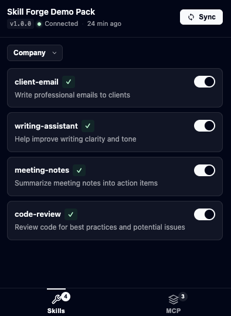

# SkillForge

Create and share Claude skills with your team. Even non-tech folks become power users.



The extension popup shows all your team skills with toggles to enable/disable them. A checkmark indicates the skill is managed and in sync with your team's configuration.

## Why SkillForge?

Claude.ai skills are powerful but managing them across a team is challenging:

- **No native team sharing** - Skills are personal, requiring manual copy-paste
- **Version drift** - Team members end up with different versions of the same skill
- **Onboarding friction** - New hires need to manually set up all team skills
- **No audit trail** - Hard to track what skills exist and who has what

SkillForge solves this by:

1. **Centralizing skills** in a Git repository with version control
2. **Hosting them** on Cloudflare R2 (or any S3-compatible storage)
3. **Syncing automatically** via a Chrome extension to team members' Claude.ai accounts

## How It Works

```
┌─────────────────┐     ┌─────────────────┐     ┌─────────────────┐
│   skills/       │     │   Cloudflare    │     │   Chrome        │
│   ├── config    │────▶│   R2 Bucket     │────▶│   Extension     │
│   └── *.md      │     │                 │     │                 │
└─────────────────┘     └─────────────────┘     └─────────────────┘
        │                                               │
   pnpm upload-skills                           Syncs to Claude.ai
```

1. Define skills as Markdown files with YAML frontmatter
2. Upload to R2 with `pnpm upload-skills`
3. Team installs the Chrome extension
4. Extension syncs skills to their Claude.ai accounts

### What's Shared vs Personal

| Level | What | Description |
|-------|------|-------------|
| **Team** (R2 Bucket) | `config.json` | The list of skills and their metadata |
| **Team** (R2 Bucket) | `SKILL.md` files | The actual skill instructions |
| **Personal** (Extension) | Toggle states | Which skills you've enabled/disabled |
| **Personal** (Claude.ai) | Skill instances | Copies of skills in your account |

**Key insight**: Skills in your Claude.ai account are **copies**, not live links. That's why "Sync" exists — to update your local copies when the team updates the source.

### Multiple Teams

Each team maintains their own R2 bucket and builds their own extension. Users install the extension for their team, which connects them to their team's skill library.

```
                           TEAM A                                    TEAM B
                    ┌─────────────────┐                       ┌─────────────────┐
                    │  R2 Bucket A    │                       │  R2 Bucket B    │
                    │  (team-a.r2.dev)│                       │  (team-b.r2.dev)│
                    │                 │                       │                 │
                    │  config.json    │                       │  config.json    │
                    │  skill-1/       │                       │  skill-x/       │
                    │  skill-2/       │                       │  skill-y/       │
                    └────────┬────────┘                       └────────┬────────┘
                             │                                         │
              ┌──────────────┼──────────────┐           ┌──────────────┼──────────────┐
              │              │              │           │              │              │
              ▼              ▼              ▼           ▼              ▼              ▼
        ┌──────────┐   ┌──────────┐   ┌──────────┐ ┌──────────┐  ┌──────────┐  ┌──────────┐
        │  Alice   │   │   Bob    │   │  Carol   │ │  David   │  │   Eve    │  │  Frank   │
        │Extension │   │Extension │   │Extension │ │Extension │  │Extension │  │Extension │
        │(Team A)  │   │(Team A)  │   │(Team A)  │ │(Team B)  │  │(Team B)  │  │(Team B)  │
        └────┬─────┘   └────┬─────┘   └────┬─────┘ └────┬─────┘  └────┬─────┘  └────┬─────┘
             │              │              │            │             │             │
             ▼              ▼              ▼            ▼             ▼             ▼
        ┌──────────┐   ┌──────────┐   ┌──────────┐ ┌──────────┐  ┌──────────┐  ┌──────────┐
        │ Claude   │   │ Claude   │   │ Claude   │ │ Claude   │  │ Claude   │  │ Claude   │
        │ Account  │   │ Account  │   │ Account  │ │ Account  │  │ Account  │  │ Account  │
        │ (Alice)  │   │  (Bob)   │   │ (Carol)  │ │ (David)  │  │  (Eve)   │  │ (Frank)  │
        └──────────┘   └──────────┘   └──────────┘ └──────────┘  └──────────┘  └──────────┘
```

- **One R2 bucket per team** — contains the shared skill library
- **One extension build per team** — hardcoded with that team's `VITE_CONFIG_URL`
- **One Claude.ai account per user** — where skills get installed as personal copies

## Quick Start

### 1. Clone and Install

```bash
git clone https://github.com/bguivarch/skillforge.git
cd skillforge
pnpm install
```

### 2. Configure Environment

See [Setting Up Cloudflare R2](#setting-up-cloudflare-r2) for how to get these credentials.

Create a `.env` file in the root:

```bash
# Cloudflare R2 Configuration
R2_ACCOUNT_ID=your_account_id
R2_ACCESS_KEY_ID=your_access_key_id
R2_SECRET_ACCESS_KEY=your_secret_access_key
R2_BUCKET_NAME=skillforge-skills
R2_PUBLIC_URL=https://pub-xxxx.r2.dev
```

Create `apps/skillforge/.env`:

```bash
VITE_CONFIG_URL=https://pub-xxxx.r2.dev/skills/config.json
```

### 3. Add Your First Skill

Browse available skills at [skills.sh](https://skills.sh/) and install one:

```bash
# See available skills from a repository
pnpm install-skill vercel-labs/agent-skills

# Or install a specific skill directly
pnpm install-skill vercel-labs/agent-skills --skill react-best-practices
```

This automatically:
- Downloads the skill to `skills/<skill-name>/`
- Updates `skills/config.json` with the new entry

### 4. Upload Skills

```bash
pnpm upload-skills
```

### 5. Build and Install Extension

```bash
pnpm build
```

Then load the extension in Chrome:
1. Go to `chrome://extensions`
2. Enable "Developer mode"
3. Click "Load unpacked"
4. Select `dist/chrome-mv3`

## Sharing Skills with Colleagues

Once you've built and configured your extension, you can share it with colleagues so they get the same skills automatically.

### 1. Build the Extension ZIP

```bash
pnpm zip
```

This creates a distributable ZIP file at `dist/skillforge-<version>-chrome.zip`.

### 2. Share the ZIP

Send the ZIP file to your colleagues via Slack, email, Google Drive, or any file sharing service.

### 3. Colleagues Install the Extension

Recipients install the extension in Chrome:

1. Unzip the file
2. Go to `chrome://extensions`
3. Enable "Developer mode"
4. Click "Load unpacked"
5. Select the unzipped folder

The extension will automatically sync skills from your configured R2 bucket - no additional setup needed for colleagues.

### Why This Works

The extension is pre-configured with your `VITE_CONFIG_URL` at build time. When colleagues install it, they automatically connect to your shared skill repository and receive all team skills.

## CLI Commands

| Command | Description |
|---------|-------------|
| `pnpm dev` | Start extension in development mode with hot reload |
| `pnpm build` | Build extension for production |
| `pnpm zip` | Create ZIP file for Chrome Web Store submission |
| `pnpm upload-skills` | Upload skills folder to R2 |
| `pnpm install-skill <repo>` | Install skills from GitHub |
| `pnpm typecheck` | Type-check TypeScript |

### Installing Skills from GitHub

Import skills from the [skills.sh](https://skills.sh/) directory or any GitHub repository:

```bash
# Interactive selection
pnpm install-skill vercel-labs/agent-skills

# Install specific skill
pnpm install-skill vercel-labs/agent-skills --skill react-best-practices

# Non-interactive (for CI)
pnpm install-skill vercel-labs/agent-skills -s web-design-guidelines --force --yes
```

**Options:**
- `-s, --skill <name>` - Install specific skill by name
- `-f, --force` - Overwrite existing skill without prompting
- `-y, --yes` - Skip all prompts

## Skill Configuration

### config.json Structure

```json
{
  "name": "Team Name Skills Pack",
  "version": "1.0.0",
  "skills": [
    {
      "name": "skill-name",
      "version": "1.0.0",
      "description": "What this skill does",
      "source": "${R2_PUBLIC_URL}/skills/skill-name/SKILL.md",
      "enabledByDefault": true,
      "allowUserToggle": true
    }
  ]
}
```

### Skill Config Fields

| Field | Required | Description |
|-------|----------|-------------|
| `name` | Yes | Unique identifier (lowercase, hyphenated) |
| `version` | Yes | Semantic version for change tracking |
| `description` | Yes | Brief description shown in UI |
| `source` | Yes | URL to SKILL.md file |
| `enabledByDefault` | No | Auto-enable on first sync (default: true) |
| `allowUserToggle` | No | Let users enable/disable (default: true) |

### SKILL.md Format

```markdown
---
name: skill-name
description: Brief description
---

# Skill Title

Main instructions go here. This is what Claude receives.

## Section 1
Content...

## Section 2
Content...
```

The YAML frontmatter contains metadata, and everything after becomes the skill instructions.

## MCP Connectors

SkillForge also supports syncing **MCP (Model Context Protocol) connectors** to your team's Claude.ai accounts. This lets you share integrations like GitHub, Linear, Gmail, and other services alongside your skills.

### How It Works

```
┌─────────────────┐     ┌─────────────────┐     ┌─────────────────┐
│   config.json   │     │   Cloudflare    │     │   Chrome        │
│   ├── skills    │────▶│   R2 Bucket     │────▶│   Extension     │
│   └── connectors│     │                 │     │                 │
└─────────────────┘     └─────────────────┘     └─────────────────┘
                                                        │
                                                Syncs to Claude.ai
                                                (Skills + Connectors)
```

1. Define connectors in `config.json` alongside your skills
2. Upload to R2 with `pnpm upload-skills`
3. Team members sync via the extension
4. Connectors appear in their Claude.ai accounts ready to use

### Adding Connectors to config.json

Add a `connectors` array to your `config.json`:

```json
{
  "name": "Team Name Skills Pack",
  "version": "1.0.0",
  "connectors": [
    {
      "name": "github-mcp",
      "url": "https://mcp.example.com/github",
      "description": "GitHub integration for code access"
    },
    {
      "name": "linear-mcp",
      "url": "https://mcp.example.com/linear",
      "description": "Linear integration for issue tracking"
    }
  ],
  "skills": [
    ...
  ]
}
```

### Connector Config Fields

| Field | Required | Description |
|-------|----------|-------------|
| `name` | Yes | Unique identifier for the connector |
| `url` | Yes | URL of the MCP server |
| `description` | No | Brief description shown in UI |

### Using Connectors

Once synced, connectors appear in Claude.ai's integrations and can be used in conversations. Popular MCP providers include:

- **[Composio](https://composio.dev/)** - GitHub, Linear, Gmail, Slack, and more
- **Custom servers** - Build your own MCP servers for internal tools

### Managing Connectors in the Extension

The extension popup has two tabs:
- **Skills** - Manage team and personal skills
- **MCP** - View and manage MCP connectors

Connector states:
| State | Description |
|-------|-------------|
| Managed | Installed by SkillForge, tracked |
| Orphaned | Was managed, removed from config |
| Other | User's personal connector (not managed) |

### Creating Custom Skills

Use the skill-creator to scaffold a new skill with the proper structure:

```bash
python3 .claude/skills/skill-creator/scripts/init_skill.py my-custom-skill
```

This automatically:
- Creates `skills/my-custom-skill/` with a SKILL.md template
- Adds example `scripts/`, `references/`, and `assets/` directories
- Updates `skills/config.json` with the new skill entry

Then edit `skills/my-custom-skill/SKILL.md` to add your instructions and update the description in `skills/config.json`.

### Creating Custom Skills (Manual)

If you prefer to create skills manually:

1. Create a folder in `skills/` with your skill name:

```bash
mkdir skills/my-custom-skill
```

2. Create `skills/my-custom-skill/SKILL.md`:

```markdown
---
name: my-custom-skill
description: What this skill does
---

# My Custom Skill

Instructions for Claude go here...
```

3. Add the entry to `skills/config.json`:

```json
{
  "name": "my-custom-skill",
  "version": "1.0.0",
  "description": "What this skill does",
  "source": "${R2_PUBLIC_URL}/skills/my-custom-skill/SKILL.md",
  "enabledByDefault": true,
  "allowUserToggle": true
}
```

4. Upload and sync:

```bash
pnpm upload-skills
```

## Environment Variables

### Root `.env`

| Variable | Required | Description |
|----------|----------|-------------|
| `R2_ACCOUNT_ID` | Yes | Cloudflare account ID |
| `R2_ACCESS_KEY_ID` | Yes | R2 API access key ID |
| `R2_SECRET_ACCESS_KEY` | Yes | R2 API secret access key |
| `R2_BUCKET_NAME` | Yes | R2 bucket name |
| `R2_PUBLIC_URL` | Yes | Public URL for the R2 bucket |

### Extension `.env` (`apps/skillforge/.env`)

| Variable | Required | Description |
|----------|----------|-------------|
| `VITE_CONFIG_URL` | Yes | URL to your hosted config.json |

## Project Structure

```
skillforge/
├── apps/
│   └── skillforge/          # Chrome extension (WXT + Svelte)
│       ├── entrypoints/
│       │   ├── background/  # Service worker
│       │   └── popup/       # Extension popup UI
│       ├── components/      # Svelte components
│       ├── lib/             # Shared utilities
│       └── public/          # Extension icons
├── scripts/
│   ├── upload-skills.ts     # Upload to R2
│   └── install-skill.ts     # Install from GitHub
├── skills/
│   ├── config.json          # Skill definitions
│   └── */SKILL.md           # Individual skills
└── package.json
```

## Extension Features

### Skill States

| State | Badge | Description |
|-------|-------|-------------|
| Managed | `[checkmark]` | In config, installed, version matches |
| Outdated | `[arrow up] Update` | In config, version changed |
| Orphaned | `[warning] Removed` | Was managed, removed from config |
| Other | - | User's personal skill (not managed) |

### User Actions

- **Sync All** - Install/update all skills from config
- **Update Individual** - Update a single outdated skill
- **Toggle** - Enable/disable skills (if allowed)
- **View Status** - See skill states and last sync time

### Extension Badge

Shows count of pending actions (new skills + available updates).

## Setting Up Cloudflare R2

1. Go to the [Cloudflare Dashboard](https://dash.cloudflare.com/) (create an account if needed)
2. Navigate to R2 Object Storage
3. Create a new bucket
4. **Enable public access** - This is required for the Chrome extension to fetch skills. Go to your bucket settings and enable "R2.dev subdomain" or configure a custom domain. The bucket must be publicly accessible since the extension fetches skills directly from the URL.
5. Create an API token with R2 read/write permissions
6. Copy credentials to your `.env` file

## Development

### Running Locally

```bash
# Start extension dev server
pnpm dev

# This opens Chrome with the extension loaded
# Changes hot-reload automatically
```

### Tech Stack

- **Extension Framework**: [WXT](https://wxt.dev/) (Web Extension Toolkit)
- **UI**: Svelte 5
- **Language**: TypeScript
- **Storage**: WXT Storage API
- **Build**: Vite

### Architecture

```
Popup UI (Svelte)
    │
    ▼
lib/messaging.ts ──────▶ background/index.ts
                              │
                              ▼
                        sync-engine.ts
                              │
                    ┌─────────┴─────────┐
                    ▼                   ▼
            config-loader.ts      api-client.ts
                    │                   │
                    ▼                   ▼
               R2 Bucket          Claude.ai API
```

## Installing from a Shared ZIP

If a colleague shared a SkillForge extension ZIP with you, follow these steps to install it:

### Chrome

1. **Unzip the file** - Extract the ZIP to a folder (e.g., `skillforge-extension/`)

2. **Open Chrome Extensions** - Navigate to `chrome://extensions` in your browser

3. **Enable Developer Mode** - Toggle the switch in the top-right corner

4. **Load the extension** - Click "Load unpacked" and select the unzipped folder

5. **Pin the extension** - Click the puzzle icon in Chrome's toolbar and pin SkillForge for easy access

### First Sync

1. Click the SkillForge icon in your toolbar
2. Click "Sync All" to install all team skills
3. Go to [claude.ai](https://claude.ai) - your skills are ready to use

### Staying Updated

When your team updates the skills, you'll see a badge on the extension icon. Click it and hit "Sync All" to get the latest versions.

> **Note**: You don't need to set up R2 or clone any repository. The extension is pre-configured to connect to your team's skill server.

## Multi-Admin Setup

Skills are stored locally in the `skills/` folder of this repository. For **most users** (colleagues receiving skills via the extension), no Git knowledge or repository access is needed — they just install the extension and sync.

However, if **multiple people need to manage skills** (add, edit, or remove skills from the shared config), they'll need to:

1. Fork this repository (one fork per team)
2. Clone the fork
3. Make changes to the `skills/` folder
4. Commit and push to keep everyone in sync
5. Run `pnpm upload-skills` to publish changes to R2

This ensures all skill administrators stay synchronized and changes are tracked with version control.

> **Note**: We're aware this workflow adds friction for teams with multiple skill administrators. If SkillForge gets traction and people find it useful, we plan to add a proper backend with a web UI for collaborative skill management — no Git required.

## Contributing

1. Fork the repository
2. Create a feature branch
3. Make your changes
4. Submit a pull request

## Privacy & Analytics

SkillForge collects **anonymous usage data** to help improve the product:

- Install count
- Feature usage (skills imported)
- Extension version

**We don't collect:**

- Personal information
- Browsing history
- Skill content
- IP addresses

All data is aggregated and anonymous.

[View our analytics code](apps/skillforge/lib/tracking.ts) — it's open source like everything else.

## License

Apache 2.0 - See [LICENSE](LICENSE) for details.

## Related Projects

- [skills.sh](https://skills.sh/) - The Agent Skills Directory
- [vercel-labs/agent-skills](https://github.com/vercel-labs/agent-skills) - Community skills
- [vercel-labs/add-skill](https://github.com/vercel-labs/add-skill) - Official CLI
